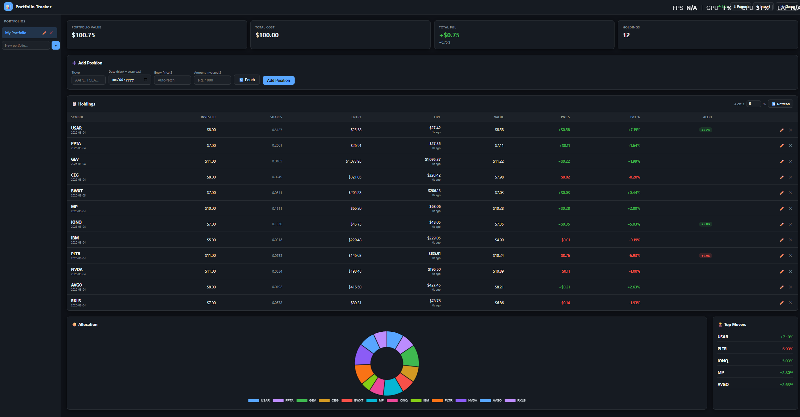

# Monte Carlo Predict Stock

> A self-hosted FastAPI service that turns OHLCV candles into a **regime-aware directional signal**, runs a **Monte Carlo simulation** under one of seven path models, and serves a live dashboard with trade setup, scanner, and backtest — all in a single Python process. No build step, no npm, no broker integration required.

**Research / paper-trading only. Not investment advice. Not a recommendation engine.**

---

<!-- 📸 IMAGE SUGGESTION #1 — Hero screenshot
     Place a full-width dashboard overview here (the main dashboard.html view).
     Use: resource_image/dash_board.png (already exists)
     Example:
     
-->


## Table of Contents

- [Features](#features)
- [Quick Start](#quick-start)
- [Environment Configuration](#environment-configuration)
- [Docker](#docker)
- [Architecture](#architecture)
- [Monte Carlo Models](#monte-carlo-models)
- [Key Configuration](#key-configuration)
- [HTTP API Reference](#http-api-reference)
- [Frontend](#frontend)
- [Project Layout](#project-layout)
- [Contributing](#contributing)
- [Disclaimer](#disclaimer)

---

## Features

- **7 Monte Carlo path models** — Gaussian GBM, Student-t, GARCH(1,1), Bootstrap, Merton jump-diffusion, Ensemble blend, and a Microstructure-aware model
- **Regime detection** — DFA / R² / Donchian / ADX composite producing 8 market-state labels
- **HMM market structure** — Hidden Markov Model (Baum-Welch) for Trending / Ranging / Volatile classification with probability breakdown
- **Hawkes process** — excitation scoring on demand/supply zones
- **Options flow analysis** — put/call ratio, unusual activity detector (Vol/OI > 1.5× and volume > 500), DTE filter, LEAPS tagging
- **Social sentiment** — live `/ws/news` WebSocket feed with 50-item ring buffer, client-side dedup, filter pills, and exponential-backoff reconnect
- **Macro enrichment** — FRED-powered macro overlay via `/api/macro`
- **Walk-forward backtest** — per-trade stats with directional hit rate, Brier score, log-loss, and Spearman correlation
- **Trade setup engine** — entry / stop-loss / take-profit / RR + Kelly sizing, gated behind a 40% confidence threshold
- **Zone scanner** — demand/supply zone detection (pivot → cluster → score) + breakout/breakdown scanner
- **SQLite signal log** — lightweight persistence via `core/store.py`
- **Zero-build frontend** — single-page dashboard in vanilla HTML/CSS/JS, served by FastAPI `StaticFiles`

---

## Quick Start

Requires **Python 3.10+**.

```bash
# 1. Clone and create a virtual environment
git clone https://github.com/your-username/Monte_Carlo_Predict_Stock.git
cd Monte_Carlo_Predict_Stock

python -m venv .venv
source .venv/bin/activate        # Windows: .venv\Scripts\activate

# 2. Install dependencies
pip install -r requirements.txt

# 3. Copy the example env and configure
cp .env.example .env
# Edit .env — set TICKER, and optionally FRED_API_KEY / ALPACA_API_KEY

# 4. Run
python main.py
# Dashboard available at http://localhost:8000
```

Verify the code is lint-clean:

```bash
ruff check .       # 0 errors
```

---

## Environment Configuration

Copy `.env.example` to `.env`. The minimum required variables are:

```env
TICKER=AAPL
CANDLE_INTERVAL=15m
MC_MODEL=garch
```

For real-time bars, set your Alpaca credentials. The data fetcher falls through **Alpaca → Polygon → yfinance** automatically:

```env
ALPACA_API_KEY=your_key
ALPACA_SECRET_KEY=your_secret
```

For macro enrichment via FRED:

```env
FRED_API_KEY=your_fred_key
```

All configuration is hot-reloadable at runtime via `POST /api/config` — see [Key Configuration](#key-configuration) for the full table.

---

## Docker

```bash
# Build and run with Docker Compose
cp .env.example .env          # fill in your API keys
docker compose up --build     # http://localhost:8000

# Or without Compose
docker build -t mc-trader .
docker run --rm -p 127.0.0.1:8000:8000 --env-file .env mc-trader
```

The container binds to `0.0.0.0:8000` internally; `docker-compose.yml` maps it to `127.0.0.1:8000` on the host (localhost only). To expose to a network, change to `0.0.0.0:8000:8000` **and** set `API_KEY` in your `.env`.

---

## Architecture

```
main.py
 └─ api/server.py          FastAPI app — routes, WebSocket, poll loop
     └─ core/__init__.py   analyse(df) → JSON dict
         ├─ indicators.py  RSI, EMA, MACD, BB, ADX, OBV, VWAP, kurtosis
         ├─ regime.py      DFA / R² / Donchian / ADX composite → 8 labels
         ├─ signal.py      Regime-weighted composite score + confidence
         ├─ zones.py       Demand/supply zone detection (pivot → cluster → score)
         ├─ montecarlo.py  7 path models (see Monte Carlo Models)
         ├─ trade_setup.py Entry / SL / TP / RR + Kelly sizing
         ├─ backtest.py    Walk-forward harness with per-trade stats
         └─ store.py       SQLite signal log (contextlib.suppress on errors)
```

Optional enrichment modules (invoked on-demand, not in the poll loop):

| Module | Endpoint | Notes |
|---|---|---|
| `hmm_regime.py` | `/api/market-structure` | Always runs on this endpoint regardless of `HMM_ENABLED` flag |
| `hawkes.py` | `/api/market-structure` | Same — flag gates poll loop only |
| `sentiment.py` | `/api/sentiment`, `/ws/news` | Unusual activity detector added in Phase 3 |
| `macro.py` | `/api/macro` | Requires `FRED_API_KEY` |

<!-- 📸 IMAGE SUGGESTION #2 — Monte Carlo fan chart
     Show a MC path fan chart for QQQ or similar.
     Use: resource_image/QQQ_result_img.png (already exists)
     Example:
     
-->

---

## Monte Carlo Models

Select via the `MC_MODEL` env var or `POST /api/config` at runtime.

| Model | Innovation | Best for |
|---|---|---|
| `gaussian` | GBM / Normal (Itô) | Calm regimes, baseline comparison |
| `student_t` | Student-t (df derived from kurtosis) | Fat-tailed return distributions |
| `garch` | GARCH(1,1) σ-path | Volatility clustering — **default** |
| `bootstrap` | Resampled historical returns | Unknown distribution shape |
| `jump` | Merton jump-diffusion | Earnings releases / event-driven tails |
| `ensemble` | GARCH + bootstrap + jump blend | Most-robust general-purpose choice |
| `microstructure` | GARCH + volume profile + CVD + DFA | Level-aware path generation |

See [`docs/math.md`](docs/math.md) for full derivations (GBM Itô, Merton, GARCH, DFA, Bootstrap).

<!-- 📸 IMAGE SUGGESTION #3 — MC result screenshots
     Add both result images side by side (QQQ and Oil).
     resource_image/QQQ_result_img.png and resource_image/oil_result_img.png
     
     
     
-->

---

## Key Configuration

All tunables live in `config.py` as a `Config` dataclass. Every field can be overridden via `.env` or `POST /api/config` at runtime — no restart required.

| Variable | Default | Notes |
|---|---|---|
| `TICKER` | `PLTR` | Any ticker supported by yfinance / Alpaca |
| `CANDLE_INTERVAL` | `15m` | `1m 2m 5m 15m 30m 1h 4h 1d` |
| `MC_MODEL` | `garch` | See [Monte Carlo Models](#monte-carlo-models) |
| `MC_SIMULATIONS` | `2000` | Increase to `10000` for research-grade output |
| `MC_FORWARD_CANDLES` | `5` | Forecast horizon in bars |
| `LOOKBACK` | `50` | History bars fed to the analysis pipeline |
| `POLL_SECONDS` | `120` | Live data refresh interval |
| `HMM_ENABLED` | `False` | Adds ~3–10 s per poll cycle when enabled |
| `HAWKES_ENABLED` | `False` | Adds ~3–10 s per poll cycle when enabled |
| `API_KEY` | _(unset)_ | If set, all `/api/*` routes require `X-Api-Key` header |
| `HOST` | `127.0.0.1` | Set to `0.0.0.0` for Docker / LAN access |
| `FRED_API_KEY` | _(unset)_ | Required for `/api/macro` |

> **Note:** `HMM_ENABLED` / `HAWKES_ENABLED` only gate the live poll loop. The `/api/market-structure` endpoint always runs both regardless — it has its own loading spinner and is only invoked on explicit user action.

---

## HTTP API Reference

```
GET  /                         Dashboard (single-page app)
GET  /api/health               Liveness probe
GET  /api/signal               Force a fresh analysis immediately
GET  /api/config               Read current configuration
POST /api/config               Update ticker, interval, model, lookback, etc.
POST /api/backtest             Run walk-forward backtest
GET  /api/history              Historical signal log
GET  /api/metrics              Aggregate performance metrics
GET  /api/metrics/accuracy     Directional accuracy breakdown
GET  /api/export.csv           Download signal history as CSV
POST /api/scan                 Breakout / breakdown scanner
POST /api/zone-scan            Zone + EMA scanner
GET  /api/market-structure     HMM + Hawkes + blended zone reaction probs
GET  /api/sentiment            Options flow + unusual activity
GET  /api/sentiment/global     Global sentiment summary
GET  /api/news                 Latest news headlines
GET  /api/fear-greed           Fear & Greed index
GET  /api/macro                FRED macro indicators
WS   /ws                       Server-push — new analysis on every poll tick
WS   /ws/news                  Live news feed with 50-item ring buffer
```

All `/api/*` endpoints return JSON. If `API_KEY` is set in `.env`, include it as `X-Api-Key: <key>` in every request header.

---

## Frontend

Single-page dashboard at `/` — **no build step, no npm, no framework**. Static assets are served by FastAPI's `StaticFiles` mount from `static/`.

The frontend was refactored across Phases 2–7 from a monolithic 7000-line HTML file into modular JS IIFEs:

| File | Owns |
|---|---|
| `static/js/scanner.js` | Breakout / breakdown scanner UI (~385 lines) |
| `static/js/right-panel.js` | Confidence colour scale, trade-setup gate, backtest KPIs |
| `static/js/tabs/options.js` | Options flow + unusual activity table with DTE filter |
| `static/js/tabs/market-structure.js` | HMM / Hawkes error boundaries, state-aware empty states, Retry button |
| `static/js/tabs/sentiment.js` | `/ws/news` feed, ring buffer, filter pills, backoff reconnect |
| `static/js/index.js` | Module manifest / version marker |

**Trade Setup confidence gate** (Phase 7): the entry / stop / target levels grid only renders when `ts.valid === true` AND `confidence > 40%`. Below that threshold the card shows **⊘ No Edge** instead of potentially misleading levels.

<!-- 📸 IMAGE SUGGESTION #4 — Portfolio tracker screenshot
     Add a screenshot of the portfolio tracker (paper-trading panel).
     Create resource_image/Portfolio.png and place it here:
     
     NOTE: This image is currently missing from resource_image/ — add it before publishing.
-->

---

## Project Layout

```
├── main.py                  Entry point (uvicorn launcher)
├── config.py                Config dataclass — all tunables
├── requirements.txt         Runtime + dev dependencies
├── pyproject.toml           ruff + pytest config
├── Dockerfile
├── docker-compose.yml
├── CHANGELOG.md
├── CONTRIBUTING.md
├── SECURITY.md
├── .env.example             Copy to .env and fill in keys
├── api/
│   ├── server.py            FastAPI app, all routes, WebSocket
│   └── models.py            Pydantic request/response models
├── core/                    Analysis pipeline
│   ├── __init__.py          analyse(df) → JSON
│   ├── indicators.py        RSI, EMA, MACD, BB, ADX, OBV, VWAP, kurtosis
│   ├── regime.py            DFA / R² / Donchian / ADX composite
│   ├── signal.py            Regime-weighted score + confidence
│   ├── zones.py             Demand/supply zone detection
│   ├── zone_scanner.py      Zone + EMA scanner
│   ├── montecarlo.py        7 path models
│   ├── trade_setup.py       Entry / SL / TP / RR + Kelly sizing
│   ├── backtest.py          Walk-forward harness
│   ├── store.py             SQLite signal log
│   ├── hmm_regime.py        Hidden Markov Model (Baum-Welch)
│   ├── hawkes.py            Hawkes process excitation scoring
│   ├── sentiment.py         Options flow + unusual activity
│   ├── news_stream.py       News headline fetcher
│   ├── macro.py             FRED macro enrichment
│   ├── hurst.py             Hurst exponent / DFA
│   ├── volume_profile.py    Volume profile / POC
│   └── levels.py            Key price levels
├── static/
│   ├── css/
│   │   ├── dashboard.css
│   │   └── portfolio.css
│   └── js/
│       ├── index.js
│       ├── scanner.js
│       ├── right-panel.js
│       └── tabs/
│           ├── market-structure.js
│           ├── options.js
│           └── sentiment.js
├── templates/
│   └── dashboard.html       Single-page app shell
├── docs/
│   └── math.md              Derivations: GBM Itô, Merton, GARCH, DFA, Bootstrap
├── tests/
│   ├── conftest.py
│   ├── test_api.py
│   ├── test_backtest.py
│   ├── test_hurst.py
│   ├── test_indicators.py
│   ├── test_montecarlo.py
│   ├── test_signal.py
│   ├── test_store.py
│   └── test_zones.py
└── resource_image/          Screenshot assets for README
```

---

## Contributing

See [CONTRIBUTING.md](CONTRIBUTING.md) for the full guide. Quick summary:

```bash
pip install -r requirements.txt   # includes dev dependencies

ruff check .                       # must pass — 0 errors
ruff format --check .              # must pass
pytest -v                          # 58 tests, all green
mypy core/ api/ config.py          # advisory (failures don't block merge)
```

Any change to a simulation model, statistical estimator, or financial formula must include a docstring justification, a regression test with a fixed `np.random.default_rng(seed)`, and an update to [`docs/math.md`](docs/math.md).

---

## Disclaimer

This software is provided for **research and educational purposes only**. It is **not investment advice** and is not produced by a registered investment adviser. The authors are not liable for any losses incurred from its use. Past simulated performance does not guarantee future returns. **Always paper-trade before risking real capital.**
