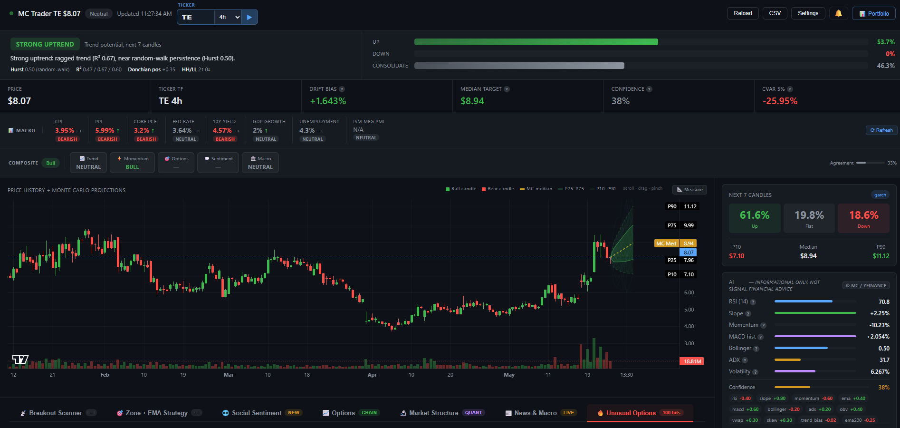

# Monte Carlo Predict Stock

> Self-hosted stock research dashboard: regime signal, Monte Carlo paths, options flow, GEX, scanner, and backtest. A FastAPI backend plus a modern Next.js frontend — start both with one command.

**Paper trading / research only. Not investment advice.**

---

<!-- hero screenshot -->


## Table of Contents

- [Features](#features)
- [Quick Start](#quick-start)
- [Two Frontends](#two-frontends)
- [Environment Configuration](#environment-configuration)
- [Docker](#docker)
- [Architecture](#architecture)
- [Monte Carlo Models](#monte-carlo-models)
- [Key Configuration](#key-configuration)
- [HTTP API Reference](#http-api-reference)
- [Project Layout](#project-layout)
- [Contributing](#contributing)
- [Disclaimer](#disclaimer)

---

## Features

- **7 Monte Carlo path models** — Gaussian GBM, Student-t, GARCH(1,1), Bootstrap, Merton jump-diffusion, Ensemble blend, and a Microstructure-aware model.
- **Regime detection** — DFA / R² / Donchian / ADX composite producing 8 market-state labels.
- **HMM market structure** — Hidden Markov Model (Baum-Welch) for Trending / Ranging / Volatile classification with probability breakdown.
- **Hawkes process** — excitation scoring on demand/supply zones.
- **Options flow** — unusual-activity scanner with **sweep vs block** classification, **per-style premium thresholds** (sweeps ≥ $50K, blocks ≥ $100K), **ask/bid-side** lean estimation (bid-side filtered out), and **high-volume-ETF exclusion**.
- **Options GEX / Max Pain** — Black-Scholes gamma exposure by strike, gamma flip, call/put walls, and max-pain.
- **Social sentiment** — live `/ws/news` WebSocket feed with ring buffer, dedup, and backoff reconnect.
- **Macro enrichment** — FRED-powered macro overlay via `/api/macro`.
- **Walk-forward backtest** — per-trade stats with directional hit rate, Brier score, log-loss, and Spearman correlation.
- **Trade setup engine** — entry / stop / target / RR + Kelly sizing, gated behind a confidence threshold.
- **Scanners** — breakout/breakdown and demand/supply zone scanners across curated watchlists.
- **SQLite signal log** — lightweight persistence via `core/store.py`.

---

## Quick Start

Requires **Python 3.10+** and (for the Next.js UI) **Node 18.18+**.

```bash
# 1. Clone and create a virtual environment
git clone https://github.com/qle107/Monte_Carlo_Predict_Stock.git
cd Monte_Carlo_Predict_Stock

python -m venv .venv
source .venv/bin/activate        # Windows: .venv\Scripts\activate

# 2. Install Python dependencies
pip install -r requirements.txt

# 3. Copy the example env and configure
cp .env.example .env             # Windows: copy .env.example .env

# 4. Run everything — backend + frontend
python main.py
```

`python main.py` starts the FastAPI backend **and** the Next.js dev server. On the
first run it installs the frontend's npm packages automatically (when
`frontend/node_modules` is missing), then launches both:

```
Backend  : http://localhost:8000      (legacy dashboard at /)
Frontend : http://localhost:3000      (Next.js UI)
```

Flags / env:

| Option | Effect |
|---|---|
| `python main.py --no-frontend` or `NO_FRONTEND=1` | Backend only (skip Next.js) |
| `FRONTEND_PORT=4000` | Run the Next.js dev server on a different port |

> If `npm` isn't on your PATH, the launcher logs a warning and runs the backend
> only — install Node.js to enable the frontend.

---

## Two Frontends

This project ships **two** UIs against the same API. Pick whichever you prefer.

### 1. Next.js app (`frontend/`, port 3000) — recommended

Modern App-Router + TypeScript + Tailwind UI. Routes:

| Route | Panel |
|---|---|
| `/` | Overview |
| `/chart` | SVG candlestick chart + EMA/Bollinger/VWAP overlays, crosshair, trade levels |
| `/flow` | Options flow feed — sweeps & blocks, ask-side conviction |
| `/gex` | GEX / Max Pain — net gamma by strike, walls, γ-flip |
| `/scanner` | Breakout / breakdown scanner with score bars |
| `/signal` | Signal + Monte Carlo fan chart, regime, trade setup |

The dev server proxies `/api/*` and `/ws/*` to the FastAPI backend
(`frontend/next.config.mjs`), so there's no CORS to configure. Override the
backend target with `BACKEND_URL`. See [`frontend/README.md`](frontend/README.md)
for the full frontend guide and migration notes.

Run it standalone:

```bash
cd frontend
npm install
npm run dev          # http://localhost:3000
```

### 2. Legacy dashboard (`templates/dashboard.html`, port 8000)

The original zero-build single-page dashboard, served by FastAPI's `StaticFiles`
from `static/`. Still available at `http://localhost:8000/`. A standalone options
flow feed also lives at `http://localhost:8000/flow`.

---

## Environment Configuration

Copy `.env.example` to `.env`. Minimum:

```env
CANDLE_INTERVAL=15m
MC_MODEL=garch
```

Startup ticker is `DEFAULT_TICKER` in `config.py` (currently `PLTR`). Change it
there, or pick a symbol in either UI / `POST /api/config`.

For real-time bars, the fetcher falls through **Alpaca → Polygon → yfinance**:

```env
ALPACA_API_KEY=your_key
ALPACA_SECRET_KEY=your_secret
```

For macro enrichment via FRED:

```env
FRED_API_KEY=your_fred_key
```

All configuration is hot-reloadable at runtime via `POST /api/config` — see
[Key Configuration](#key-configuration).

---

## Docker

```bash
cp .env.example .env          # fill in your API keys
docker compose up --build     # http://localhost:8000

# Or without Compose
docker build -t mc-trader .
docker run --rm -p 127.0.0.1:8000:8000 --env-file .env mc-trader
```

The Docker image runs the **backend** (legacy dashboard at `/`). To serve the
Next.js UI in production, build it separately (`cd frontend && npm run build &&
npm run start`) behind the same gateway, or run it on its own host with
`BACKEND_URL` pointed at the API.

The container binds `0.0.0.0:8000` internally; `docker-compose.yml` maps it to
`127.0.0.1:8000` (localhost only). To expose it to a network, change to
`0.0.0.0:8000:8000` **and** set `API_KEY` in `.env`.

---

## Architecture

```
main.py                        Entry point — launches uvicorn + (optionally) Next.js
 └─ api/server.py              FastAPI app — routes, WebSocket, poll loop
     └─ core/__init__.py       analyse(df) → JSON dict
         ├─ indicators.py      RSI, EMA, MACD, BB, ADX, OBV, VWAP, kurtosis
         ├─ regime.py          DFA / R² / Donchian / ADX composite → 8 labels
         ├─ signal.py          Regime-weighted composite score + confidence
         ├─ zones.py           Demand/supply zone detection (pivot → cluster → score)
         ├─ montecarlo.py      7 path models (see Monte Carlo Models)
         ├─ options_flow.py    Unusual options, sweep/block, GEX / max pain
         ├─ scanner.py         Breakout/breakdown scanner + watchlists
         ├─ trade_setup.py     Entry / SL / TP / RR + Kelly sizing
         ├─ backtest.py        Walk-forward harness with per-trade stats
         └─ store.py           SQLite signal log

frontend/                      Next.js app (App Router + TS + Tailwind)
 └─ proxies /api and /ws to the FastAPI backend
```

Optional enrichment modules (invoked on-demand, not in the poll loop):

| Module | Endpoint | Notes |
|---|---|---|
| `hmm_regime.py` | `/api/market-structure` | Always runs here regardless of `HMM_ENABLED` |
| `hawkes.py` | `/api/market-structure` | Flag gates the poll loop only |
| `sentiment.py` | `/api/sentiment`, `/ws/news` | Options flow + unusual activity |
| `macro.py` | `/api/macro` | Requires `FRED_API_KEY` |

---

## Monte Carlo Models

Select via the `MC_MODEL` env var or `POST /api/config` at runtime.

| Model | Innovation | Best for |
|---|---|---|
| `gaussian` | GBM / Normal (Itô) | Calm regimes, baseline comparison |
| `student_t` | Student-t (df derived from kurtosis) | Fat-tailed return distributions |
| `garch` | GARCH(1,1) σ-path | Volatility clustering — **default** |
| `bootstrap` | Resampled historical returns | Unknown distribution shape |
| `jump` | Merton jump-diffusion | Earnings / event-driven tails |
| `ensemble` | GARCH + bootstrap + jump blend | Robust general-purpose choice |
| `microstructure` | GARCH + volume profile + CVD + DFA | Level-aware path generation |

See [`docs/math.md`](docs/math.md) for full derivations.

---

## Key Configuration

All tunables live in `config.py` as a `Config` dataclass. Most can be overridden
via `.env` or `POST /api/config` at runtime — no restart required.

| Variable | Default | Notes |
|---|---|---|
| `DEFAULT_TICKER` (`config.py`) | `PLTR` | Startup symbol |
| `CANDLE_INTERVAL` | `15m` | `1m 2m 5m 15m 30m 1h 4h 1d` |
| `MC_MODEL` | `garch` | See [Monte Carlo Models](#monte-carlo-models) |
| `MC_SIMULATIONS` | `2000` | Increase to `10000` for research-grade output |
| `MC_FORWARD_CANDLES` | `5` | Forecast horizon in bars |
| `LOOKBACK` | `50` | History bars fed to the pipeline |
| `POLL_SECONDS` | `120` | Live data refresh interval |
| `HMM_ENABLED` | `False` | Adds ~3-10 s per poll cycle when enabled |
| `HAWKES_ENABLED` | `False` | Adds ~3-10 s per poll cycle when enabled |
| `API_KEY` | _(unset)_ | If set, protected `/api/*` routes require `X-Api-Key` |
| `HOST` | `127.0.0.1` | Set to `0.0.0.0` for Docker / LAN access |
| `FRED_API_KEY` | _(unset)_ | Required for `/api/macro` |

---

## HTTP API Reference

```
GET  /                          Legacy dashboard (single-page app)
GET  /flow                      Standalone options-flow feed page
GET  /api/health                Liveness probe
GET  /api/signal                Force a fresh analysis immediately
GET  /api/config                Read current configuration
POST /api/config                Update ticker, interval, model, lookback, etc.
POST /api/backtest              Run walk-forward backtest
GET  /api/history               Historical signal log
GET  /api/metrics               Aggregate performance metrics
GET  /api/metrics/accuracy      Directional accuracy breakdown
GET  /api/export.csv            Download signal history as CSV
POST /api/scan                  Breakout / breakdown scanner
POST /api/zone-scan             Zone + EMA scanner
GET  /api/scan/watchlists       Available watchlists and their tickers
GET  /api/options/unusual       Unusual options (sweep/block, side, ETF filters)
GET  /api/options/hot           Volume-spike → unusual options pipeline
GET  /api/options/gex           GEX profile, max pain, call/put walls
GET  /api/market-structure      HMM + Hawkes + blended zone reaction probs
GET  /api/sentiment             Options flow + unusual activity
GET  /api/sentiment/global      Global sentiment summary
GET  /api/news                  Latest news headlines
GET  /api/fear-greed            Fear & Greed index
GET  /api/macro                 FRED macro indicators
WS   /ws                        Server-push — new analysis on every poll tick
WS   /ws/news                   Live news feed with ring buffer
```

### `GET /api/options/unusual` — key query params

| Param | Default | Meaning |
|---|---|---|
| `watchlist` | `all_optionable` | Named universe (or pass `tickers=AAPL,MSFT`) |
| `min_sweep_premium` | `50000` | Keep sweeps at/above this notional |
| `min_block_premium` | `100000` | Keep blocks at/above this notional |
| `exclude_bid_side` | `true` | Drop seller-initiated (bid-side) prints |
| `exclude_high_volume_etfs` | `true` | Drop index/sector/leverage/vol ETFs |
| `max_dte` | `60` | Max days-to-expiry |
| `top_n` | `50` | Max hits returned |

> **Data caveat:** the options endpoints use yfinance **chain snapshots**, not the
> per-trade tape. Sweep/Block, ask/bid side, and row time are principled
> approximations (volume/OI and last-vs-mid). For true per-print fidelity, plug in
> a flow provider (Polygon options trades, CBOE, Unusual Whales).

All `/api/*` endpoints return JSON. If `API_KEY` is set, include it as
`X-Api-Key: <key>` on protected routes.

---

## Project Layout

```
├── main.py                  Entry point — launches uvicorn + Next.js dev server
├── config.py                Config dataclass — all tunables
├── requirements.txt
├── pyproject.toml           ruff + pytest config
├── Dockerfile / docker-compose.yml
├── .env.example
├── api/
│   ├── server.py            FastAPI app, all routes, WebSocket
│   └── models.py            Pydantic request/response models
├── core/                    Analysis pipeline
│   ├── __init__.py          analyse(df) → JSON
│   ├── indicators.py        RSI, EMA, MACD, BB, ADX, OBV, VWAP, kurtosis
│   ├── regime.py            DFA / R² / Donchian / ADX composite
│   ├── signal.py            Regime-weighted score + confidence
│   ├── zones.py             Demand/supply zone detection
│   ├── scanner.py           Breakout/breakdown scanner + watchlists
│   ├── montecarlo.py        7 path models
│   ├── options_flow.py      Unusual options (sweep/block/side), GEX, max pain
│   ├── trade_setup.py       Entry / SL / TP / RR + Kelly sizing
│   ├── backtest.py          Walk-forward harness
│   ├── store.py             SQLite signal log
│   ├── hmm_regime.py        Hidden Markov Model (Baum-Welch)
│   ├── hawkes.py            Hawkes process excitation scoring
│   ├── sentiment.py         Options flow + unusual activity
│   ├── news_stream.py       News headline fetcher
│   └── macro.py             FRED macro enrichment
├── static/
│   ├── flow.html            Standalone options-flow feed (served at /flow)
│   ├── css/ · js/           Legacy dashboard assets
├── templates/
│   └── dashboard.html       Legacy single-page app shell
├── frontend/                Next.js app (App Router + TypeScript + Tailwind)
│   ├── app/                 Routes: / · /chart · /flow · /gex · /scanner · /signal
│   ├── components/          FlowFeed, SignalPanel, PriceChart, ScannerPanel, GexPanel, …
│   ├── lib/                 Typed API clients, indicators, Black-Scholes, samples
│   ├── next.config.mjs      Proxies /api and /ws to FastAPI
│   ├── tailwind.config.ts
│   └── README.md            Frontend guide + migration checklist
├── docs/
│   └── math.md              Derivations: GBM Itô, Merton, GARCH, DFA, Bootstrap
└── tests/                   pytest suite
```

---

## Contributing

See [CONTRIBUTING.md](CONTRIBUTING.md) for the full guide.

```bash
# Backend
pip install -r requirements.txt
ruff check .            # must pass
ruff format --check .   # must pass
pytest -v               # test suite must be green
mypy core/ api/ config.py   # advisory

# Frontend
cd frontend
npm install
npm run lint
npm run build           # type-checks + production build
```

Any change to a simulation model, statistical estimator, or financial formula
must include a docstring justification, a regression test with a fixed
`np.random.default_rng(seed)`, and an update to [`docs/math.md`](docs/math.md).

---

## Disclaimer

This software is provided for **research and educational purposes only**. It is
**not investment advice** and is not produced by a registered investment adviser.
The authors are not liable for any losses incurred from its use. Past simulated
performance does not guarantee future returns. **Always paper-trade before
risking real capital.**
