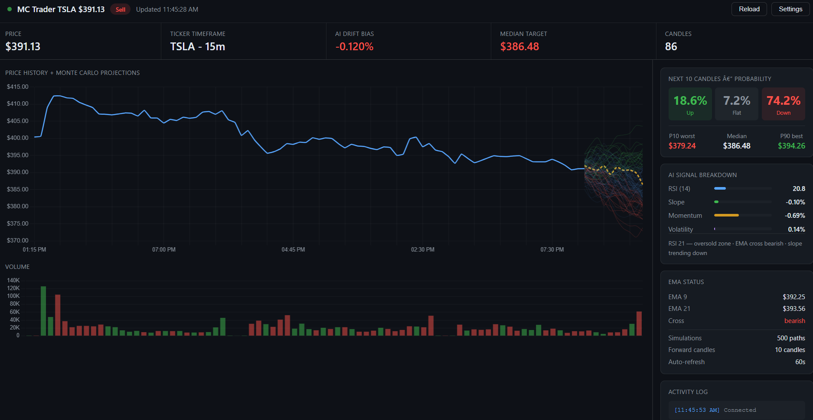

# MC Trader — Local Monte Carlo Trading Dashboard

A fully local Python app that fetches live 15m candles, runs AI-adjusted
Monte Carlo simulation, and streams results to a live web dashboard.

---

## Quick start (3 steps)

### 1. Install Python dependencies
```bash
cd mc_trader
pip install -r requirements.txt
```

### 2. Configure your API keys
Edit the `.env` file:
```
ALPACA_API_KEY=your_key_here
ALPACA_SECRET_KEY=your_secret_here
TICKER=PLTR
```

**Which API should I use?**

| Source       | Cost    | Delay      | Sign up |
|--------------|---------|------------|---------|
| yfinance     | Free    | ~15 min    | None — works out of the box |
| Alpaca       | Free    | Real-time  | https://alpaca.markets (free paper account) |
| Polygon.io   | $29/mo  | Real-time  | https://polygon.io |

> Tip: Start with yfinance (no sign-up needed). When ready for live trading,
> add your free Alpaca keys for real-time data.

### 3. Run the server
```bash
python server.py
```

Then open your browser: **http://localhost:8000**

---

## Project structure

```
mc_trader/
├── .env                 ← your API keys and config
├── requirements.txt
├── data_fetcher.py      ← fetches candles (yfinance / Alpaca / Polygon)
├── engine.py            ← indicators + AI signal + Monte Carlo
├── server.py            ← FastAPI WebSocket server
└── templates/
    └── dashboard.html   ← live web dashboard
```

---

## How the AI signal works

The engine computes 4 indicators from the last 50 candles:

1. **RSI (14)** — oversold (<35) pushes drift positive, overbought (>65) negative
2. **Linear slope** — direction of last 8 candles
3. **Momentum** — % change over last 5 candles
4. **EMA cross** — 9-period vs 21-period crossover

These are combined into a composite score (−1 to +1) that biases the
per-candle drift in the Monte Carlo simulation. 500 paths are run for
the next 10 candles, producing Up/Flat/Down probabilities.

---

## Changing the ticker or timeframe

Edit `.env`:
```
TICKER=AAPL
CANDLE_INTERVAL=5m
MC_SIMULATIONS=1000
```

Valid intervals: `1m`, `5m`, `15m`, `1h`, `1d`

---

## Running at market open automatically (optional)

Add a cron job (Mac/Linux):
```bash
# Run at 9:30 AM ET on weekdays
30 9 * * 1-5 cd /path/to/mc_trader && python server.py >> trader.log 2>&1
```

---

## Disclaimer

This tool is for **educational purposes only**.
- Monte Carlo simulation does not guarantee future results
- Always paper trade before using real money
- Past volatility patterns do not predict future movements
