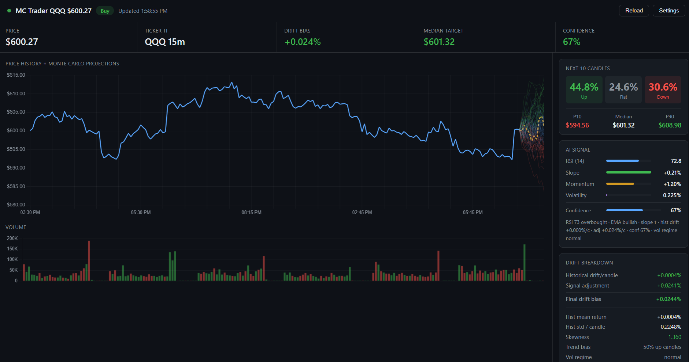
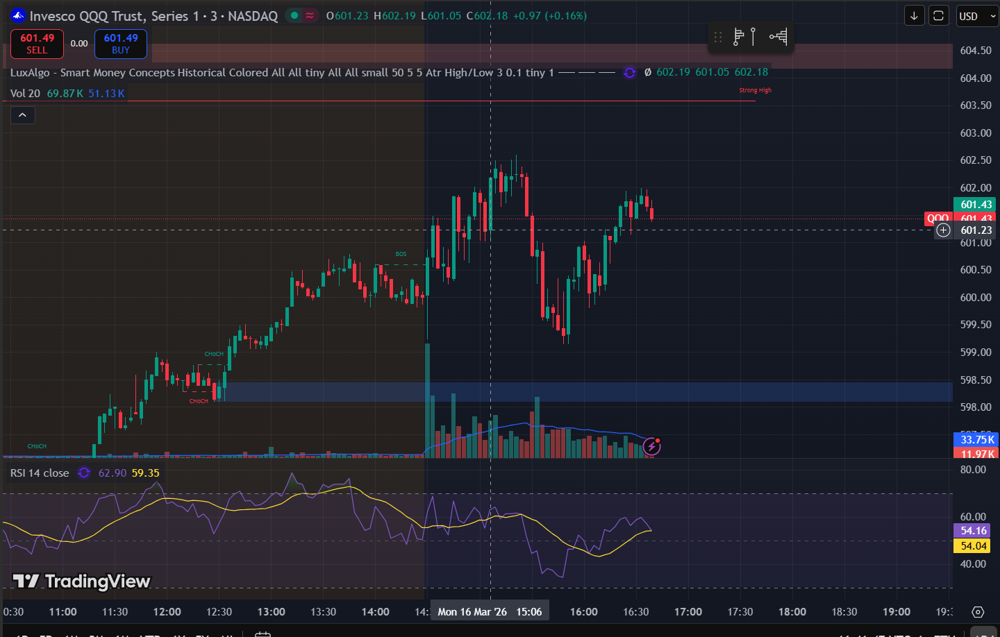
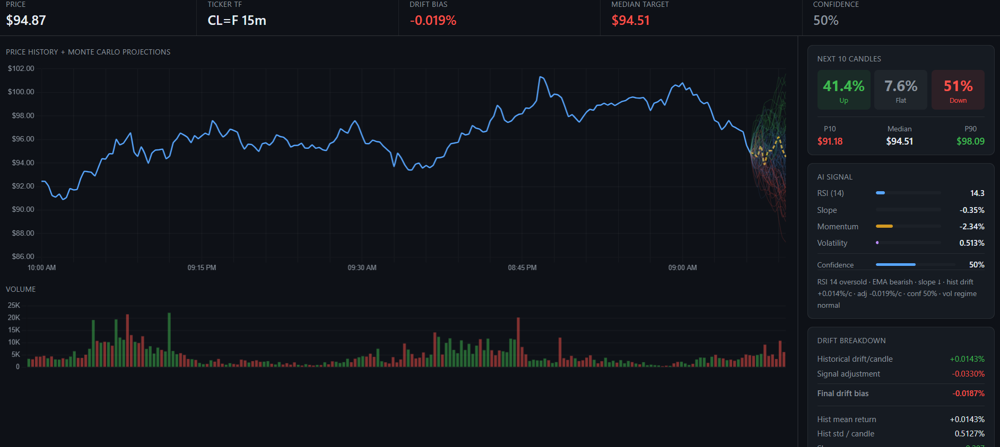
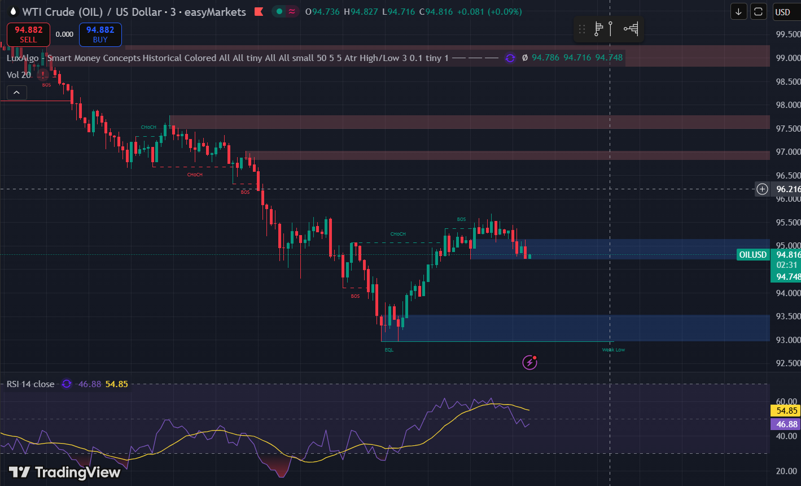

# MC Trader — Local Monte Carlo Trading Dashboard

A fully local Python app that fetches live candles, runs an AI-adjusted
Monte Carlo simulation with six innovation models, walk-forward backtests
itself, scans entire watchlists for breakouts and zone setups, and streams
everything to a live web dashboard.

---

## Quick start

### 1. Install
```bash
cd Monte_Carlo_Predict_Stock
pip install -r requirements.txt
```

### 2. (Optional) Configure API keys
The app works out of the box with yfinance. For real-time data, edit `.env`:
```
ALPACA_API_KEY=...
ALPACA_SECRET_KEY=...
POLYGON_API_KEY=...        # optional, paid

TICKER=NBIS
CANDLE_INTERVAL=15m
MC_MODEL=garch              # gaussian | student_t | garch | bootstrap | jump | ensemble
MC_SIMULATIONS=10000
MC_FORWARD_CANDLES=10
```

| Source     | Cost   | Delay     | Sign up |
|------------|--------|-----------|---------|
| yfinance   | Free   | ~15 min   | None — used as fallback |
| Alpaca     | Free   | Real-time | https://alpaca.markets |
| Polygon.io | Paid   | Real-time | https://polygon.io |

### 3. Run
```bash
python main.py
```
Open **http://localhost:8000**.

### 4. Run the tests
```bash
pytest -q
```

---

## Project layout

```
Monte_Carlo_Predict_Stock/
├── main.py                  ← entry point (uvicorn)
├── config.py                ← validated runtime config
├── requirements.txt
├── api/
│   ├── __init__.py          ← exports `app`
│   ├── server.py            ← FastAPI: routes, WS, lifespan, poll loop
│   └── models.py            ← Pydantic request models
├── core/
│   ├── __init__.py          ← `analyse(df, n_sim, n_fwd, mc_model)`
│   ├── fetcher.py           ← Alpaca → Polygon → yfinance fallback chain
│   ├── indicators.py        ← RSI / EMA / MACD / Bollinger / ADX / OBV / VWAP / …
│   ├── signal.py            ← Composite signal + entropy-aware confidence
│   ├── montecarlo.py        ← 6 innovation models (gaussian, student-t, GARCH, bootstrap, jump, ensemble)
│   ├── backtest.py          ← Walk-forward scoring (hit rate, Brier, log-loss, calibration)
│   ├── store.py             ← SQLite signal log
│   ├── scanner.py           ← Breakout / breakdown watchlist scanner
│   ├── trade_setup.py       ← Entry / TP / SL / R:R engine (MC P75/P90 + zone-based)
│   ├── zones.py             ← Demand & supply zone detector (swing pivots + clustering)
│   └── zone_scanner.py      ← Zone + EMA 20/50/200 strategy scanner
├── templates/
│   └── dashboard.html       ← live dashboard: chart, scanner tabs, trade setup sidebar
└── tests/
    ├── conftest.py
    ├── test_indicators.py
    ├── test_signal.py
    ├── test_montecarlo.py
    ├── test_backtest.py
    ├── test_store.py
    └── test_api.py
```

---

## How the signal works

`core/indicators.py` computes a wide indicator set on each fetch:

| Indicator        | Used for                                                            |
|------------------|---------------------------------------------------------------------|
| RSI (14)         | Mean-reversion read                                                 |
| Linear slope     | Short-term trend direction                                          |
| Momentum         | 5-candle %-change                                                   |
| EMA 9/21 cross   | Trend regime                                                        |
| EMA 20/50/200    | Bull/bear stack detection for zone scanner                          |
| MACD histogram   | Momentum confirmation                                               |
| Bollinger pos    | Mean-reversion / band breakouts                                     |
| ADX              | Trend strength (paired with slope sign)                             |
| OBV slope        | Volume confirmation                                                 |
| VWAP distance    | Above/below today's volume-weighted price                           |
| Skew / kurtosis  | Tail asymmetry & fatness (drives Student-t df)                      |
| Trend bias       | % of historical candles closing up                                  |
| Vol regime       | Recent vs long realised vol — scales MC vol                         |
| Hurst exponent   | Trend persistence vs mean-reversion                                 |

`core/signal.py` combines them into a composite score in [−1, +1] with
calibrated weights, plus an **entropy-aware confidence**: high only when
most active sub-signals agree on direction *and* their average magnitude
is large.

That score sets the per-candle drift bias for the simulation:

```
base_drift  = stock's actual mean return per candle
signal_adj  = composite × confidence × (½ stdev)
drift_bias  = clip(base_drift + signal_adj, ±2σ)   # the "no 99.9%" guard
```

---

## Monte Carlo models

Selectable via `MC_MODEL` env var, the Settings panel, or `POST /api/config`:

| Model        | What it does                                                                 |
|--------------|------------------------------------------------------------------------------|
| `gaussian`   | Classic GBM with Normal innovations.                                         |
| `student_t`  | Heavy-tailed innovations; df fit from observed excess kurtosis.              |
| `garch`      | GARCH(1,1)-style volatility clustering. **Default.**                         |
| `bootstrap`  | Resamples the stock's own historical returns — preserves the real distribution. |
| `jump`       | Merton jump-diffusion: Gaussian + Poisson-triggered jumps for gap regimes.   |
| `ensemble`   | Weighted blend of GARCH + Bootstrap + Jump — most robust. ★ Recommended.    |

Per-step returns are clipped to ±25% so a single tail event can't detonate the path.

The dashboard renders both the inner P25–P75 band and the outer P10–P90 band as a
confidence cone, plus a sample of 30 paths and the P50 (median) path.

---

## Trade Setup engine

`core/trade_setup.py` converts raw MC output into a complete trade plan:

- **Entry** — current ask price
- **TP1** — MC P75 percentile of forward paths (real 10k-path target)
- **TP2** — MC P90 percentile of forward paths (runner target)
- **Stop Loss** — tighter of ATR-based stop and fixed-% stop (per-timeframe caps)
- **R:R** — calculated for both SL methods; best one is recommended
- **MC Probabilities** — P(price reaches TP1), P(reaches TP2), P(stopped out), computed by walking all 10k paths against the levels
- **Stop-hunt warning** — flagged when P(SL hit before TP1) > 35%

### Zone-based targets (shown alongside MC targets)

When demand/supply zones are detected on the same chart, the sidebar also shows:

| Field       | Meaning |
|-------------|---------|
| Zone TP1    | Nearest opposing zone (e.g. supply zone above for longs) |
| Zone TP2    | Second zone beyond TP1 |
| Zone SL     | Zone edge ± 0.2×ATR (structural stop below demand / above supply) |
| Zone R:R    | Risk:Reward using zone SL and Zone TP1 |
| Zone type   | `demand_bounce` / `supply_break` / `supply_bounce` / `demand_break` |
| Zone context| Whether price is currently at a demand zone, supply zone, or between |

---

## Demand & Supply Zone detector

`core/zones.py` finds institutional price zones from OHLCV data:

1. **Pivot detection** — swing highs/lows using a ±4-bar window
2. **Clustering** — nearby pivots within 0.8×ATR are merged into one zone
3. **Scoring** (0–1):
   - Touches (0.4 weight) — how many times price returned to the zone
   - Recency (0.3) — zones formed more recently score higher
   - Freshness (0.2) — untested zones hold better than re-tested ones
   - Formation quality (0.1)
4. **Broken zone removal** — zones price has closed through by >0.5×ATR are discarded
5. Returns up to 5 demand + 5 supply zones, plus `nearest_demand` and `nearest_supply`

Zone width = level ± 0.3×ATR on each side.

---

## Scanners

### Breakout & Breakdown Scanner (`POST /api/scan`)

Scans a watchlist (or custom ticker list, up to 200) in parallel for momentum setups:

- Fetches candles for each ticker concurrently (up to 20 workers)
- Computes all indicators + regime + MC signal
- Scores each ticker on a −1 → +1 scale
- Returns `breakouts` / `breakdowns` / `neutral` / `all` arrays
- Each result includes a full trade setup (entry, SL, TP1, TP2, R:R, P(TP1))
- Table is sortable by Score, RSI, ADX, 52w High, Confidence, A–Z
- **Load ↗** button syncs any ticker into the main chart for full 10k-path MC analysis

Available watchlists: `sp500_large`, `tech`, `etfs`, `biotech`, `momentum`, or custom.

### Zone + EMA Strategy Scanner (`POST /api/zone-scan`)

Scans for Demand/Supply zone + EMA 20/50/200 alignment setups:

- Needs ≥120 bars (defaults to 120-bar lookback for EMA200 reliability)
- Detects the four zone scenarios:

| Setup          | Meaning                                                       |
|----------------|---------------------------------------------------------------|
| Demand Bounce  | Price at demand zone + bullish EMA stack — look long         |
| Supply Break   | Price breaking above supply zone + bull stack — momentum long |
| Supply Bounce  | Price at supply zone + bearish EMA stack — look short        |
| Demand Break   | Price breaking below demand zone + bear stack — momentum short|

- **Scoring** (0–1):
  - Zone strength (0.4 weight)
  - EMA alignment (0.4)
  - RSI confirmation (0.1)
  - OBV slope (0.1)
- Returns `longs` / `shorts` / `no_setup` / `all` + meta stats

**Zone scanner table columns:**

| Column | Description |
|--------|-------------|
| Ticker / Price / Score | Symbol, last price, setup quality 0–1 |
| Setup | Zone scenario pill (Demand Bounce / Supply Break / Supply Reject / Demand Break) |
| RSI / ADX | Momentum and trend strength |
| EMA 20 | EMA value · % distance from price · `↑✦` golden cross or `↓✦` death cross if fired in last 5 bars |
| EMA 50 | Same, for the 50-period EMA |
| EMA 200 | Same, for the 200-period EMA |
| Support 1 / Support 2 | Nearest and second-nearest demand zones below price — labeled **Strong Support ★** if strength ≥ 70%, otherwise Support 1 / 2; shows level, % distance, strength %, touch count, and FRESH tag if untested |
| Resistance 1 / Resistance 2 | Same for supply zones above price |
| Load ↗ | Loads ticker into main chart for full 10k-path MC analysis |

**EMA stack classifications (used for setup scoring, shown as pill):**

| Label       | Condition |
|-------------|-----------|
| 🟢 Bull Stack  | EMA20 > EMA50 > EMA200 and price above all three |
| 🔴 Bear Stack  | EMA20 < EMA50 < EMA200 and price below all three |
| ↑ Above 200 | Price above EMA200 but EMAs not fully aligned |
| ↓ Below 200 | Price below EMA200 but EMAs not fully aligned |
| ~ Mixed     | No clear alignment |

**EMA cross detection** — scans the last 5 bars for crossovers between EMA20/50, EMA50/200, and EMA20/200. A `↑✦` golden cross or `↓✦` death cross is shown inline in the EMA cell when a cross fired recently.

---

## Dashboard

The dashboard is a single-page app served at `/`. Key panels:

| Panel | What it shows |
|-------|---------------|
| **Header** | Live ticker, signal badge, connection status, Reload / CSV / Settings |
| **Regime banner** | Current market regime + Hurst, R², Donchian position, HH/LL counts |
| **Potential bars** | MC-estimated up / down / flat potential for next N candles |
| **Candlestick chart** | OHLCV candles + MC confidence cone (P25–P75 inner, P10–P90 outer) |
| **Volume chart** | Per-candle volume colored by candle direction |
| **Scanner tabs** | Switch between Breakout Scanner and Zone + EMA Scanner |
| **MC probabilities** | P(up) / P(flat) / P(down) + P10 / Median / P90 price targets |
| **AI signal** | Sub-indicator bars + confidence + reasoning text |
| **Trade Setup** | Entry / TP1 / TP2 / SL / R:R / MC probabilities + Zone Targets panel |
| **Drift & risk** | Full drift breakdown, CVaR, EMA200, 52w high, vol-of-vol |
| **Backtest** | Walk-forward hit rate, Brier score, log-loss, calibration ρ |
| **Activity log** | Timestamped event stream |

Settings panel (gear icon) lets you change ticker, timeframe, MC model, simulations,
forward candles, and poll interval without restarting the server. The **Load ↗** button
in either scanner tab syncs all settings (n_sim, n_forward, lookback, mc_model) into
the main chart for a consistent comparison.

---

## API reference

```
GET  /                       dashboard HTML
GET  /api/health             liveness check
GET  /api/signal             trigger fresh analysis + broadcast
GET  /api/config             current config + valid choices
POST /api/config             update any config field (validated)
POST /api/backtest           walk-forward backtest over recent history
GET  /api/history            recent persisted signals (newest first)
GET  /api/metrics            aggregate accuracy stats per ticker
GET  /api/export.csv         CSV dump of signal history
POST /api/scan               breakout/breakdown scanner
GET  /api/scan/watchlists    list available watchlists + tickers
POST /api/zone-scan          Zone + EMA strategy scanner
WS   /ws                     server-push: new analysis on every poll
```

`POST /api/config` body (all fields optional):
```json
{
  "ticker": "AAPL",
  "interval": "15m",
  "mc_model": "ensemble",
  "n_sim": 10000,
  "n_forward": 10,
  "lookback": 50,
  "poll_seconds": 60
}
```

`POST /api/scan` body:
```json
{
  "watchlist": "tech",
  "interval": "1d",
  "lookback": 60,
  "max_concurrent": 8,
  "min_score_abs": 0.0
}
```

`POST /api/zone-scan` body:
```json
{
  "watchlist": "sp500_large",
  "interval": "1d",
  "lookback": 120,
  "max_concurrent": 8
}
```

`POST /api/backtest` body:
```json
{ "history_bars": 200, "n_forward": 10, "n_sim": 500, "mc_model": "garch" }
```

---

## Persistent history

Every analysis is logged to a local SQLite file (`mc_trader.db` by default;
override with `DB_PATH`). The dashboard reads it for `/api/history` and
`/api/metrics`, and you can dump it to CSV at any time via
`/api/export.csv?ticker=AAPL`.

---

## Running on a schedule

```bash
# 9:30 ET weekdays
30 9 * * 1-5 cd /path/to/Monte_Carlo_Predict_Stock && python main.py >> trader.log 2>&1
```

---

## Screenshots

### QQQ simulation


### Result


### Oil simulation


### Result


---

## Changelog

### 2026-05-04 — Zone + EMA Strategy Scanner (redesigned table)
- Redesigned Zone Scanner table: replaced Entry/Zone SL/TP1/TP2/R:R columns with per-EMA columns (EMA 20, EMA 50, EMA 200) and structured Support/Resistance zone columns
- Each EMA column shows: value, % distance from price (green above / red below), and a `↑✦` / `↓✦` cross indicator when a golden or death cross fired in the last 5 bars (checks EMA20/50, EMA50/200, EMA20/200 pairs)
- Support 1 / Support 2 columns show nearest demand zones below price with label (Strong Support ★ / Support 1 / 2), level, % distance, strength %, touch count, and FRESH tag for untested zones
- Resistance 1 / Resistance 2 columns show same structure for supply zones above price
- Backend: added `_ema_series()` and `_ema_cross()` helpers to `core/zone_scanner.py` for cross detection
- Backend: added `cross_20_50`, `cross_50_200`, `cross_20_200`, `dist_ema20/50/200` fields to `ZoneScanResult`
- Backend: added `demand_zones` and `supply_zones` structured lists (up to 3 each, sorted nearest-to-price) with auto-labeling to `ZoneScanResult`
- Zone display now uses `_build_zone_list()` which auto-labels zones as Strong Support/Resistance (≥70% strength) or Support/Resistance 1/2 by proximity rank

### 2026-05-04 — Zone + EMA Strategy Scanner (initial)
- Added `core/zones.py`: demand/supply zone detector using swing pivot clustering, strength scoring (touches, recency, freshness), and broken-zone removal
- Added `core/zone_scanner.py`: async Zone + EMA 20/50/200 strategy scanner with four setup types (demand_bounce, supply_break, supply_bounce, demand_break), 0–1 composite scoring, and full trade setup per ticker
- Added `POST /api/zone-scan` endpoint (reuses `ScanRequest` model, 120-bar default lookback)
- Dashboard: added tab switcher between Breakout Scanner and Zone + EMA Scanner with color-coded tabs (blue / purple)
- Dashboard: Zone Targets panel in Trade Setup sidebar — shows zone TP1/TP2/SL/R:R alongside MC P75/P90 targets
- Trade Setup: zone fields added to `TradeSetup` dataclass (`zone_tp1`, `zone_tp2`, `zone_sl`, `zone_rr`, `zone_type`, `zone_context`, `zone_strength`)

### 2026-05-03 — Trade Setup engine + scanner fixes
- Added `core/trade_setup.py`: full Entry/TP/SL/R:R engine using real MC P75/P90 paths, ATR-based stops, fixed-% stops, per-timeframe caps, and path-aware stop probability
- Wired trade setup into main analysis loop and scanner (`trade_setup_from_analysis`, `trade_setup_from_scan`)
- Added Trade Setup card to sidebar: banner (LONG / SHORT / NO ENTRY), level grid, dual SL detail, R:R pills, MC probabilities, stop-hunt warning
- Added Entry / SL / TP1 / TP2 / R:R / P(TP1) columns to breakout scanner table
- Fixed `n_sim` validation cap: raised from 5,000 → 50,000
- Fixed scanner TP estimation: replaced `potential_up × 0.06` (produced absurd targets) with ATR × 1.5 / ATR × 2.5 with per-timeframe percentage caps
- Fixed direction dict mismatch: scanner direction strings (`bullish`, `bearish`, etc.) now resolve correctly to ATR multipliers and SL percentages
- Fixed Load button: now syncs all settings (n_sim, n_forward, lookback, mc_model) into the main chart, not just ticker + interval

### 2026-04-xx — Breakout & Breakdown Scanner
- Added `core/scanner.py`: async multi-ticker scanner with concurrent fetching, regime detection, and signal scoring
- Added `POST /api/scan` and `GET /api/scan/watchlists` endpoints
- Dashboard: full scanner UI with watchlist selector, interval picker, progress bar, summary pills, top-picks cards, sortable/filterable table
- Built-in watchlists: sp500_large, tech, etfs, biotech, momentum, custom

### 2026-04-xx — Ensemble MC model + volatility improvements
- Added `ensemble` MC model: weighted blend of GARCH (50%) + Bootstrap (30%) + Jump (20%)
- Volatility surface improvements: vol-of-vol tracking, GARCH parameter fitting
- Added Hurst exponent to regime detection

---

## Disclaimer

This tool is for **educational purposes only**.

- Monte Carlo simulation does not guarantee future results.
- Always paper trade before using real money.
- Past volatility patterns do not predict future movements.
