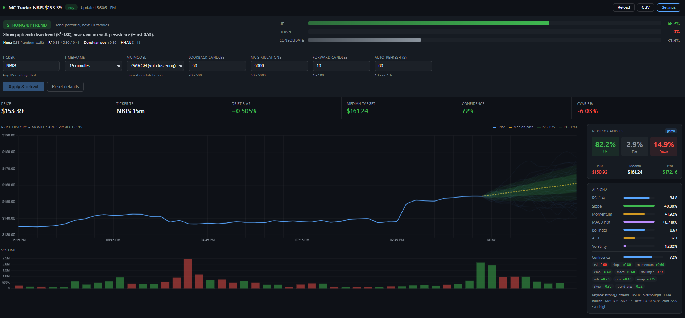

# MC Trader — Local Monte Carlo Trading Dashboard

A fully local Python app that fetches live candles, runs an AI-adjusted
Monte Carlo simulation with five different innovation models, walk-forward
backtests itself, and streams everything to a live web dashboard.

---

## Quick start

### 1. Install
```bash
cd Monte_Carlo_Predict_Stock
pip install -r requirements.txt
```

### 2. (Optional) Configure API keys
The app works out of the box with yfinance. For real-time data, edit `.env`:
```
ALPACA_API_KEY=...
ALPACA_SECRET_KEY=...
POLYGON_API_KEY=...        # optional, paid

TICKER=PLTR
CANDLE_INTERVAL=15m
MC_MODEL=garch              # gaussian | student_t | garch | bootstrap | jump
MC_SIMULATIONS=500
MC_FORWARD_CANDLES=10
```

| Source     | Cost   | Delay     | Sign up |
|------------|--------|-----------|---------|
| yfinance   | Free   | ~15 min   | None — used as fallback |
| Alpaca     | Free   | Real-time | https://alpaca.markets |
| Polygon.io | Paid   | Real-time | https://polygon.io |

### 3. Run
```bash
python main.py
```
Open **http://localhost:8000**.

### 4. Run the tests
```bash
pytest -q
```

---

## Project layout

```
Monte_Carlo_Predict_Stock/
├── main.py                  ← entry point (uvicorn)
├── config.py                ← validated runtime config
├── requirements.txt
├── api/
│   ├── __init__.py          ← exports `app`
│   ├── server.py            ← FastAPI: routes, WS, lifespan, poll loop
│   └── models.py            ← Pydantic request models
├── core/
│   ├── __init__.py          ← `analyse(df, n_sim, n_fwd, mc_model)`
│   ├── fetcher.py           ← Alpaca → Polygon → yfinance
│   ├── indicators.py        ← RSI / EMA / MACD / Bollinger / ADX / OBV / VWAP / …
│   ├── signal.py            ← Composite signal + entropy-aware confidence
│   ├── montecarlo.py        ← 5 innovation models (gaussian, student-t, GARCH, bootstrap, jump)
│   ├── backtest.py          ← Walk-forward scoring (hit rate, Brier, log-loss, calibration)
│   └── store.py             ← SQLite signal log
├── templates/
│   └── dashboard.html       ← live dashboard with confidence cone
└── tests/
    ├── conftest.py
    ├── test_indicators.py
    ├── test_signal.py
    ├── test_montecarlo.py
    ├── test_backtest.py
    ├── test_store.py
    └── test_api.py
```

---

## How the signal works

`core/indicators.py` computes a wide indicator set on each fetch:

| Indicator        | Used for                                                            |
|------------------|---------------------------------------------------------------------|
| RSI (14)         | Mean-reversion read                                                 |
| Linear slope     | Short-term trend direction                                          |
| Momentum         | 5-candle %-change                                                   |
| EMA 9/21 cross   | Trend regime                                                        |
| MACD histogram   | Momentum confirmation                                               |
| Bollinger pos    | Mean-reversion / band breakouts                                     |
| ADX              | Trend strength (paired with slope sign)                             |
| OBV slope        | Volume confirmation                                                 |
| VWAP distance    | Above/below today's volume-weighted price                           |
| Skew / kurtosis  | Tail asymmetry & fatness (drives Student-t df)                      |
| Trend bias       | % of historical candles closing up                                  |
| Vol regime       | Recent vs long realised vol — scales MC vol                         |

`core/signal.py` combines them into a composite score in [−1, +1] with
calibrated weights, plus an **entropy-aware confidence**: high only when
most active sub-signals agree on direction *and* their average magnitude
is large.

That score sets the per-candle drift bias for the simulation:

```
base_drift  = stock's actual mean return per candle
signal_adj  = composite × confidence × (½ stdev)
drift_bias  = clip(base_drift + signal_adj, ±2σ)   # the "no 99.9%" guard
```

---

## Monte Carlo models

Selectable via `MC_MODEL` env var, the Settings panel, or `POST /api/config`:

| Model        | What it does                                                                 |
|--------------|------------------------------------------------------------------------------|
| `gaussian`   | Classic GBM with Normal innovations.                                         |
| `student_t`  | Heavy-tailed innovations; df fit from observed excess kurtosis.              |
| `garch`      | GARCH(1,1)-style volatility clustering. **Default.**                         |
| `bootstrap`  | Resamples the stock's own historical returns — preserves the real distribution. |
| `jump`       | Merton jump-diffusion: Gaussian + Poisson-triggered jumps for gap regimes.   |

Per-step returns are clipped to ±25% so a single tail event can't
detonate the path.

The dashboard renders both the inner P25–P75 band and the outer
P10–P90 band as a confidence cone, plus a sample of 30 paths and the
P50 (median) path.

---

## API

```
GET  /                       dashboard
GET  /api/health             liveness
GET  /api/signal             trigger fresh analysis
GET  /api/config             current config + valid choices
POST /api/config             update any config field (validated)
POST /api/backtest           walk-forward over recent history
GET  /api/history            recent persisted signals
GET  /api/metrics            aggregate stats per ticker
GET  /api/export.csv         CSV dump of signal history
WS   /ws                     server pushes new analysis on every poll
```

`POST /api/config` body (all fields optional):
```json
{
  "ticker": "AAPL", "interval": "15m", "mc_model": "garch",
  "n_sim": 500, "n_forward": 10, "lookback": 50, "poll_seconds": 60
}
```

`POST /api/backtest` body (all fields optional):
```json
{ "history_bars": 200, "n_forward": 10, "n_sim": 200, "mc_model": "garch" }
```

---

## Persistent history

Every analysis is logged to a local SQLite file (`mc_trader.db` by
default; override with `DB_PATH`). The dashboard reads it for
`/api/history` and `/api/metrics`, and you can dump it to CSV at any
time via `/api/export.csv?ticker=AAPL`.

---

## Running on a schedule

```bash
# 9:30 ET weekdays
30 9 * * 1-5 cd /path/to/Monte_Carlo_Predict_Stock && python main.py >> trader.log 2>&1
```

---

## Screenshots

### QQQ simulation


### Result


### Oil simulation


### Result


---
## After Update
### NBIS 01/05/2026 at 5:30 PM Paris Time Zone


## Disclaimer

This tool is for **educational purposes only**.

- Monte Carlo simulation does not guarantee future results.
- Always paper trade before using real money.
- Past volatility patterns do not predict future movements.
