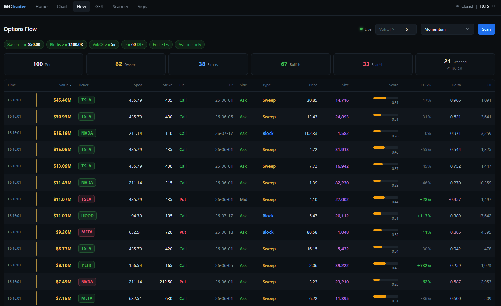
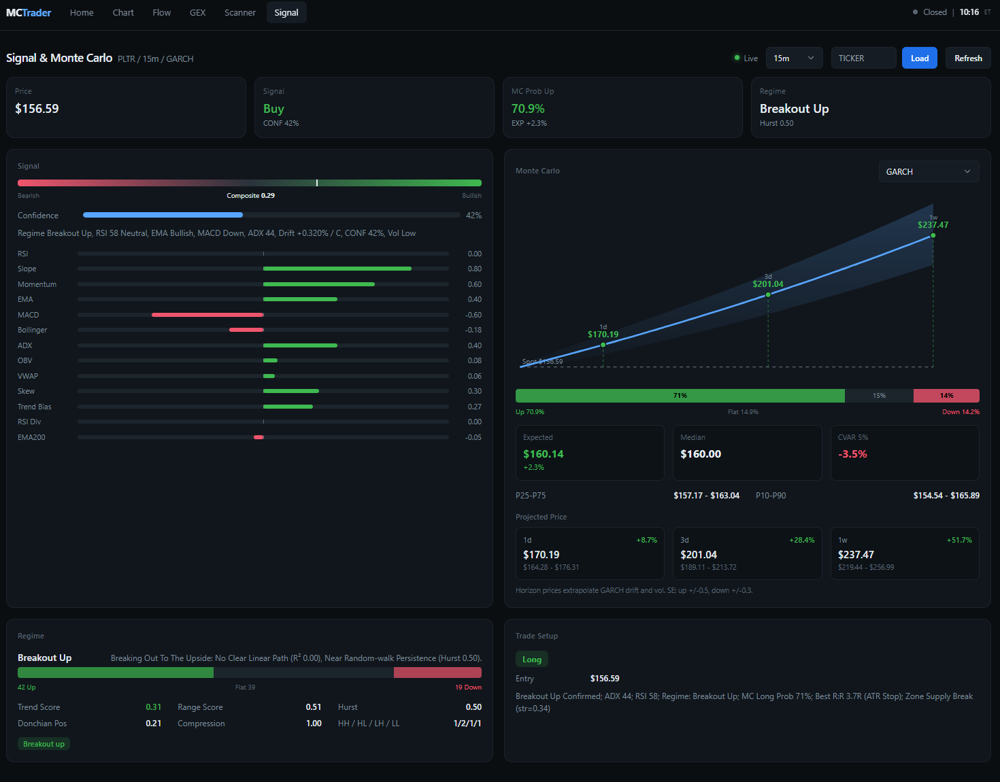

# Monte Carlo Predict Stock

Self-hosted stock research dashboard: regime signal, Monte Carlo paths, options
flow, GEX, scanner, and backtest. Python FastAPI backend plus a Next.js
frontend. Start both with `python main.py`.

**Paper trading / research only. Not investment advice.**

## Features

Monte Carlo path models (Gaussian, Student-t, GARCH, bootstrap, jump-diffusion,
ensemble, microstructure). Regime detection from DFA, R-squared, Donchian, and
ADX. Optional HMM market structure and Hawkes zone scoring.

Options flow scans unusual activity with sweep/block tags, premium filters,
ask-side lean, and ETF exclusion. GEX and max pain from a chain snapshot.
Sentiment and news over WebSocket. Macro overlay from FRED when configured.
Walk-forward backtest, trade setup (entry/stop/target/RR), breakout and zone
scanners, SQLite signal log.

## Quick start

Python 3.10+ and Node 18.18+ for the Next.js UI.

```bash
git clone https://github.com/qle107/Monte_Carlo_Predict_Stock.git
cd Monte_Carlo_Predict_Stock

python -m venv .venv
source .venv/bin/activate        # Windows: .venv\Scripts\activate

pip install -r requirements.txt
cp .env.example .env             # Windows: copy .env.example .env

python main.py
```

Backend: http://localhost:8000 (legacy dashboard at `/`)  
Frontend: http://localhost:3000

| Flag / env | Effect |
|---|---|
| `python main.py --no-frontend` or `NO_FRONTEND=1` | Backend only |
| `FRONTEND_PORT=4000` | Different frontend port |

If `npm` is missing, the launcher runs the backend only.

## Frontends

**Next.js (`frontend/`, port 3000)** - `/`, `/chart`, `/flow`, `/gex`,
`/scanner`, `/signal`. Proxies `/api/*` and `/ws/*` to FastAPI
(`BACKEND_URL` override). See [frontend/README.md](frontend/README.md).

**Legacy dashboard (`templates/dashboard.html`)** - served at
http://localhost:8000/. Standalone flow page at `/flow`.

## Configuration

Copy `.env.example` to `.env`:

```env
CANDLE_INTERVAL=15m
MC_MODEL=garch
```

Default ticker is `DEFAULT_TICKER` in `config.py` (currently `PLTR`).

Price data: Alpaca, then Polygon, then yfinance. Optional `FRED_API_KEY` for
macro. Most settings can be changed at runtime with `POST /api/config`.

## Docker

```bash
cp .env.example .env
docker compose up --build
```

Image runs the backend on port 8000. Build the Next.js app separately for
production UI.

## Layout

```
main.py              launcher (uvicorn + optional Next.js)
api/server.py        routes, WebSocket, poll loop
core/                analysis pipeline (signal, MC, flow, scanner, backtest, ...)
frontend/            Next.js UI
static/              legacy assets + /flow page
templates/           legacy dashboard shell
docs/math.md         model notes
tests/               pytest
```

## Monte Carlo models

Set with `MC_MODEL` or `POST /api/config`:

| Model | Notes |
|---|---|
| `gaussian` | GBM baseline |
| `student_t` | Fat tails from kurtosis |
| `garch` | Default; vol clustering |
| `bootstrap` | Resampled returns |
| `jump` | Merton jumps |
| `ensemble` | Blend of several |
| `microstructure` | GARCH + volume profile + CVD |

Details in [docs/math.md](docs/math.md).

## API (summary)

| Method | Path | Purpose |
|---|---|---|
| GET | `/api/signal` | Run analysis |
| GET/POST | `/api/config` | Read/update settings |
| GET | `/api/options/unusual` | Options flow scan |
| GET | `/api/options/gex` | GEX profile |
| POST | `/api/scan` | Breakout scanner |
| POST | `/api/backtest` | Backtest |
| WS | `/ws` | Live analysis push |
| WS | `/ws/news` | News stream |

Options endpoints use yfinance chain snapshots, not a live print tape.
Sweep/block and side are approximations.

Protected routes need `X-Api-Key` when `API_KEY` is set in `.env`.

## Contributing

See [CONTRIBUTING.md](CONTRIBUTING.md). Run `ruff check .`, `ruff format --check .`,
and `pytest -v` before opening a PR.

## Disclaimer

Research and education only. Not investment advice. Authors are not liable for
losses. Paper-trade before using real capital.
